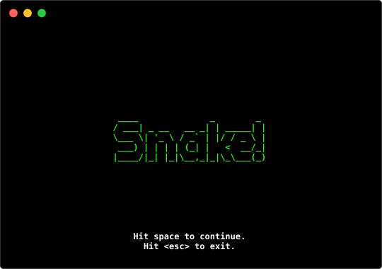
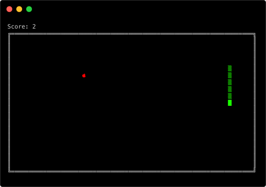

# snake-rs
The classic game Snake for the console. Written in Rust

## Getting the game
Right now the simplest way to get snake is to build it from source using Cargo. Just clone this repo and run `cargo build --release`. The compiled binary will be in `target/release/snake`.

## Running the game
Once you have built snake, just run the snake binary to start the game. Use the arrow keys to move.

## Credits
I'm using the amazing [RustBox library](https://github.com/gchp/rustbox) by @gchp for drawing to the terminal.

## License
I'm releasing this project under the MIT License. See LICENSE.txt for details.
